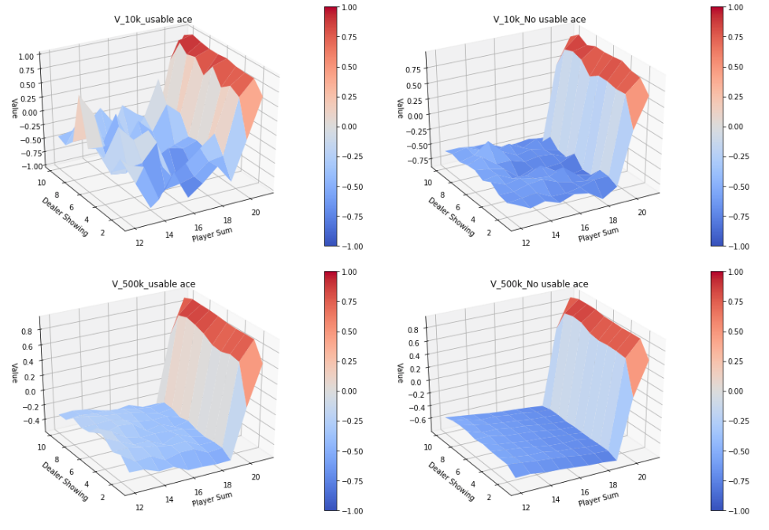
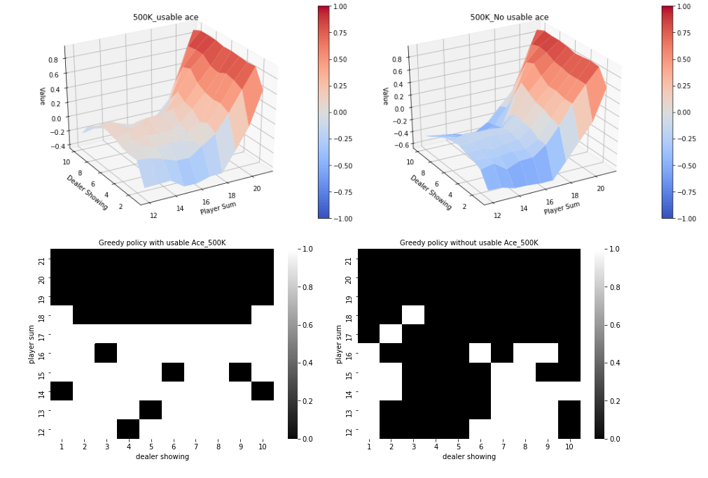

# Reinforcement-Learning

This repository contains lab and homework assignment for the course Reinforcement Learning offered in M.Sc Artificial Intelligence at the University of Amsterdam.

## Labs

### Lab 1 - Dynammic Programming, Policy Evaluation, Policy Iteration, Value Iteration, MC Control, TD Learning

In this lab we get familiar with basic concepts of Dynammic Programming and use it for the implementation of Policy Evaluation, Policy Iteration  and Value Iteration for GridWorldEnv. We also implement Monte Carlo Prediction and Monte Carlo control with \epsilon-greedy policy on  BlackjackEnv. Apart from that we also explore Temporal Difference Learning. 

   
  <i>Approximate state-value functions for the blackjack policy that sticks only on 20
or 21, computed by Monte Carlo policy evaluation.</i>
   
   
   
  <i>The optimal policy and state-value function for blackjack, found by Monte Carlo epsilon greedy policy</i>

#### Problems and Solutions

Problema and solution can be found under **ipynb** files [here](labs/lab1/).

### Lab 2 - Deep-Q Networks, Monte Carlo Reinforce, Actor-Critic Methods 

#### Problems and Solutions

Problema and solution can be found under **ipynb** files [here](labs/lab2/).

## Homeworks

Homework was is in colloboration with [Dhruba Pujary](https://github.com/druv022). Problems and Solutions to the homework assignment can be found [here](homework). 
